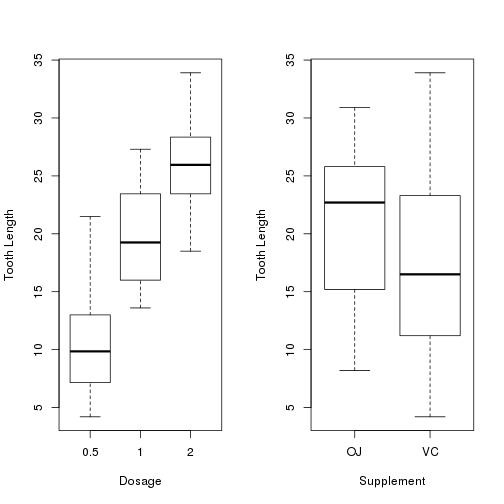

## Introduction

<strong>Treatment & Dosage Analyzer</strong> is a R program running on Shiny that helps to determine the sgnificance and effectiveness of treatment supplements and dosage levels. 
   
<strong>Treatment & Dosage Analyzer</strong> was the result of a need by budding data scientists to find answers for <em>cause-and-effect</em> questions on various datasets. Indeed, it is specific for this specific category of questions and is a powerful visual tool for evaluation.  
   
<strong>Treatment & Dosage Analyzer</strong> is implemented in <strong>R</strong> and <strong>Shiny</strong>, both <em>Open Source</em>, publicly available software packages supported by large communities of users.  

--- .class #id 

## Sample Display

<strong>Treatment & Dosage Analyzer</strong> easily shows the effectiveness of treatments by dosage, supplement or both

--- .class #id 

## Online Demo

A version of <strong>Treatment & Dosage Analyzer</strong> can be found on the following URL:
  
https://ycchew.shinyapps.io/final_project/

User will be able to slice and dice the data in various ways representative of how the <strong>Treatment & Dosage Analyzer</strong> works.  We have made the user interface easy to use, and reactive to changes in user input.

--- .class #id 

## Source Data
 
This dataset has 60 observations of tooth growth and is based on a study using supplements of either <em>Orange Juice</em> (30 observations) or <em>Vitamin C</em> (30 observations) at three different dosage levels: 0.5mg, 1.0mg, and 2.0mg (10 observations each).
